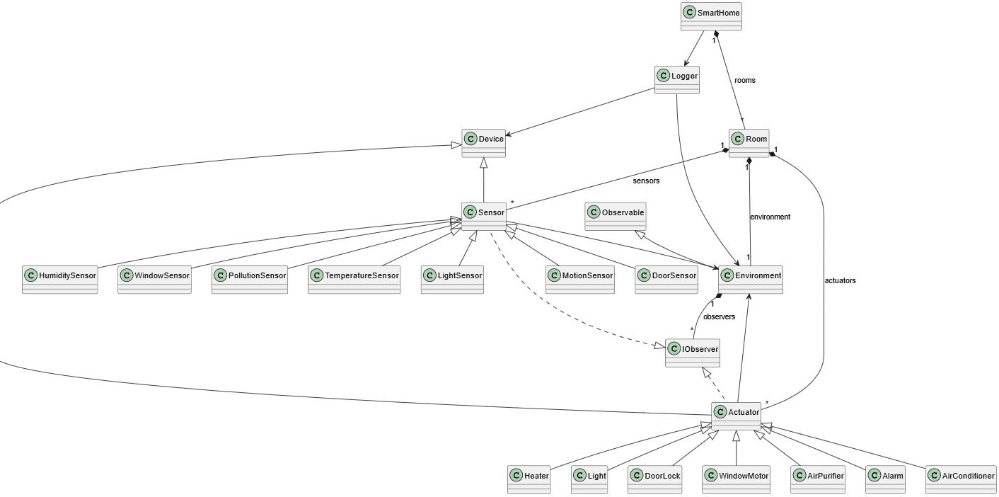

# Smart Home Simulator

## Overview
This project implements a Smart Home Simulator, written in C++, that models the interaction between sensors and actuators in a home environment. The program simulates environmental parameters such as temperature, humidity, light, motion, doors state, windows state, and pollution levels, and demonstrates the behavior of the smart home system based on the data from this simulated environment. 

## System Architecture

The Smart Home Simulator is organized around **Devices**, divided into **Sensors** and **Actuators**.

- **Sensors** monitor environmental parameters such as temperature, light, motion, humidity, window and door states, and pollution by observing the **Environment**.

- **Actuators** respond to changes in Sensors by controlling devices like heaters, lights, door locks, window motors, air purifiers, alarms, and air conditioners.

- Each **Room** contains its own Environment, Sensors, and Actuators, allowing local monitoring and control. The **Logger** records the status of Devices and the Environment, while the **SmartHome** class aggregates multiple Rooms and coordinates the overall simulation.

This architecture follows an **observer-based design**, where Sensors observe the Environment, Actuators observe Sensors, and changes propagate automatically through the system, simulating realistic smart home behavior.

<br>



## Building and Running with CMake

This project uses **CMake** to manage the build process. Follow these steps to compile and run the Smart Home Simulator:

```bash
mkdir build
cd build

cmake ..
cmake --build .

cd Debug
./SmartHome
```

## Output
The simulation generates data for the example devices. The output is saved in `results/log.txt`.

## License
This project is open-source and can be freely modified and distributed under an appropriate open-source license.
